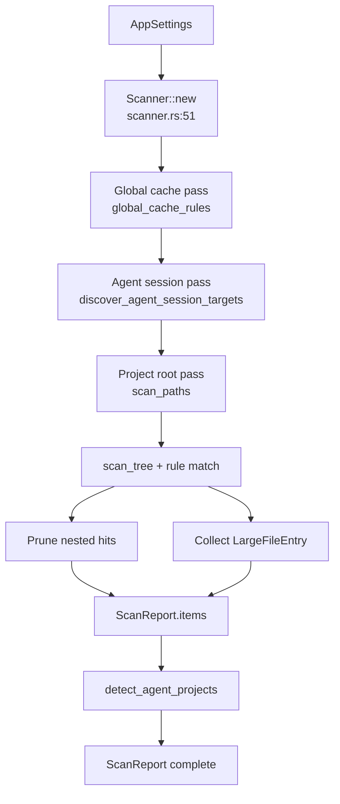

# Scanner Domain

**Module path:** `crates/clv-core/src/scanner.rs`  
**Generated:** 2026-08-28

---

## What This Module Does

The Scanner is the app's inventory robot. Before you can decide what to delete, something has to walk your filesystem, recognize that `target/` is a Rust build cache while `.git/` is not, and attach a human-readable explanation to each finding. That is the Scanner's job—it transforms a messy directory tree into a structured `ScanReport` that every other part of the app consumes.

Without accurate scanning, cleanup would be dangerous guesswork. The Scanner therefore prioritizes **precision over speed**: nested matches are pruned so you do not delete both `node_modules` and a child `.cache` inside it separately; protected system paths are skipped entirely; and progress is throttled so the UI stays smooth during large walks.

---

## Core Capabilities

1. **Three-phase scan pipeline** — Global home caches (`scanner.rs:88-108`), agent session directories (`scanner.rs:111-127`), then user-configured project roots (`scanner.rs:130-150`).

2. **Rule-based matching** — Each directory name checked against `project_rules()` and `global_cache_rules()` defined in `crates/clv-core/src/settings/`. Rules support exact names, prefixes (`cmake-build-*`), glob markers, and parent requirements.

3. **Cancellable execution** — `scan_cancellable` checks an `AtomicBool` at phase and directory boundaries (`scanner.rs:62-76`).

4. **Throttled progress** — `ProgressThrottle` emits at most one progress event per 300ms unless forced (`scanner.rs:23-44`).

5. **Inline large-file collection** — Files above threshold collected during tree walk, finalized via `large_files.rs`.

---

## Key Components

| Component | File path | Responsibility |
|-----------|-----------|----------------|
| `Scanner` | `crates/clv-core/src/scanner.rs:46` | Scan orchestrator struct |
| `ProgressThrottle<F>` | `crates/clv-core/src/scanner.rs:23` | Rate-limits progress callbacks |
| `scan_cancellable` | `crates/clv-core/src/scanner.rs:62` | Main scan entry with cancel support |
| `scan_tree` | `crates/clv-core/src/scanner.rs` | Recursive project directory walk |
| `should_skip_dir` | `crates/clv-core/src/scanner.rs` | VCS and skip-list filtering |
| `project_rules` | `crates/clv-core/src/settings/project_rules.rs` | Per-stack cleanup patterns |
| `global_cache_rules` | `crates/clv-core/src/settings/global_rules.rs` | Home-level cache locations |
| `is_protected_system_path` | `crates/clv-core/src/paths.rs:165` | Hard block for system roots |

---

## Internal Data Flow

**Key steps:**
1. `Scanner::new(settings)` binds user preferences — `scanner.rs:51`
2. Each rule path resolved via `resolve_global_path` or project walk — `paths.rs:52`
3. Items below `MIN_SCAN_ITEM_BYTES` (1 MB) filtered to reduce noise — `scanner.rs:21`
4. Final report includes `cancelled`, `sizes_truncated` flags when applicable — `models.rs:131-133`

---

## Key Interfaces and Extension Points

Add new cleanup targets by extending rule tables rather than modifying scanner logic:

- **Project rules**: new `CleanupRule` entries in `project_rules.rs` with stack, risk, category, and `RuleDescription` ID.
- **Global caches**: entries in `global_cache_rules.rs` with home-relative paths.
- **Skip directories**: extend `is_scan_skip_dir` in `paths.rs:92`.

---

## Cross-Module Interactions

| Module | Direction | Interface | Notes |
|--------|-----------|-----------|-------|
| Settings | Depends | `AppSettings`, `CleanupRule`, rules tables | Scanner reads-only |
| Agent | Calls | `discover_agent_session_targets`, `detect_agent_projects` | Session + project grouping |
| Models | Produces | `ScanItem`, `ScanReport` | Output types |
| Messages | Uses | `RuleDescription`, `AgentReasonPart` | Typed descriptions |
| AppStore | Invoked by | `Scanner::scan_cancellable` via `services/scan.rs` | Background thread |

**In scan workflow**: AppStore spawns scan thread → Scanner produces report → saved via `save_last_scan` → views read `last_report`.

---

## Performance Considerations

- Walkdir traversal is synchronous on worker thread—no parallel directory walks (simplicity over max throughput).
- `ProgressThrottle` prevents GPUI channel saturation on fast SSDs.
- `seen_paths` HashSet deduplicates global vs project hits.
- Size calculation may set `sizes_truncated` when directory sizing hits limits during walk.

---

## Implementation Highlights

- **Nested pruning test** (`lib.rs:64-100`): matching both `node_modules` and inner `.cache` would double-count; scanner keeps only the parent match.
- **Sibling build dirs preserved** (`lib.rs:103-131`): `build/` and `app/build/` both reported as separate items.
- **Agent marker detection** integrated into project walk via `is_agent_project_path` (`lib.rs:345`).
