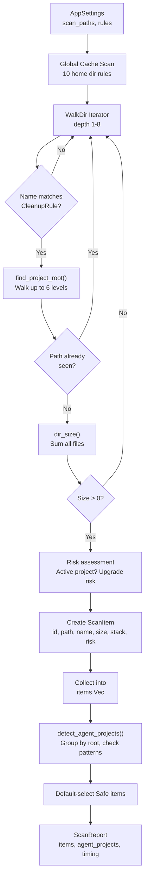

# Scanner Domain

**Module Path**: `crates/clv-core/src/Scanner`
**Generated Date**: 2026-08-20

---

## Overview

The Scanner module is the engine under the hood -- it's what makes CLV3000 Plus actually work. Without it, you'd have a pretty UI with nothing to show. It takes a set of directories the user wants checked, walks through every subdirectory up to 8 levels deep, and matches what it finds against a library of 30+ cleanup rules. Think of it as a very thorough librarian who knows exactly which books (directories) in a library (your file system) are actually just old newspapers (build caches) that can be recycled.

The scanner's intelligence lies not in AI but in pattern recognition: it knows that a directory named `target/` inside a Rust project is build output, that `node_modules/` is an npm dependency tree, and that `DerivedData/` is Xcode's build cache. It pairs this with risk assessment -- if a project was modified in the last 3 days, its safe items get upgraded to "Caution" because the developer is probably still working on it.

---

## Core Functionality

1. **Global Cache Scanning** -- First, the scanner checks 10 well-known global cache locations in the user's home directory (Cargo registry, npm cache, pip cache, etc.). These are "umbrella" caches that span multiple projects.

2. **Project Tree Walking** -- For each configured scan path, walks the directory tree using `WalkDir` with a max depth of 8. This prevents runaway recursion in deep directory structures while still reaching deeply nested project artifacts.

3. **Rule Matching** -- Each directory entry's name is compared against `project_rules()`. If the name matches a rule's `relative` field (e.g., "target", "node_modules", ".next"), the entry is a candidate for cleanup.

4. **Size Computation** -- Uses `dir_size()` which recursively sums file sizes for directories, or returns file size for individual files. This is the slowest part of scanning large directories.

5. **Risk Assessment** -- Items in projects modified within the last 3 days get their risk upgraded from Safe to Caution. Protected system paths are always skipped.

6. **Project Root Detection** -- Walks up to 6 parent levels looking for project markers (`Cargo.toml`, `package.json`, etc.) to identify which project a cleanable item belongs to.

---

## Key Components

| Component / Type | File Path | Responsibility |
|-----------------|-----------|---------------|
| `Scanner` | `crates/clv-core/src/Scanner:13` | Main scanner struct, holds settings, orchestrates scan |
| `Scanner::scan()` | `crates/clv-core/src/Scanner:22` | Public entry point -- runs full scan pipeline, returns ScanReport |
| `Scanner::scan_tree()` | `crates/clv-core/src/Scanner:106` | Walks one directory tree, matches entries against rules |
| `Scanner::try_add_rule_path()` | `crates/clv-core/src/Scanner:170` | Validates path, computes size, creates ScanItem, checks dedup |
| `dir_size()` | `crates/clv-core/src/Scanner:234` | Computes total size of a directory recursively |
| `find_project_root()` | `crates/clv-core/src/Scanner:252` | Walks up directories to find project root |
| `is_likely_active_project()` | `crates/clv-core/src/Scanner:275` | Checks if project was modified within 3 days |
| `is_agent_project_path()` | `crates/clv-core/src/Scanner:283` | Checks if a path matches agent naming patterns |
| `detect_project_stacks()` | `crates/clv-core/src/Scanner:304` | Identifies tech stacks present in a project root |

---

## Internal Data Flow

**Key step details**:
1. **Global Cache Scan**: Iterates `global_cache_rules()` and calls `try_add_rule_path()` for each (`crates/clv-core/src/Scanner.rs:39-51`)
2. **WalkDir with depth check**: Limits recursion to 8 levels, emits progress callbacks every 3 levels (`crates/clv-core/src/Scanner.rs:118-167`)
3. **Size computation**: `dir_size()` uses `WalkDir` internally to sum all file sizes (`crates/clv-core/src/Scanner.rs:234-244`)
4. **Risk upgrade**: If project root was modified within 3 days, Safe items become Caution (`crates/clv-core/src/Scanner.rs:194-201`)

---

## Key Interfaces and Extension Points

- **Adding new cleanup targets**: Append to `project_rules()` or `global_cache_rules()` in `settings.rs`
- **Custom risk logic**: Modify `is_likely_active_project()` to change the activity threshold
- **Progress reporting**: The `on_progress` callback (`FnMut(ScanProgress)`) allows callers to observe scan progress

---

## Interactions with Other Modules

| Interaction Module | Direction | Interface | Description |
|-------------------|-----------|-----------|-------------|
| settings | Depends on | `project_rules()`, `global_cache_rules()`, `AppSettings` | Reads cleanup rules and scan configuration |
| models | Depends on | `ScanItem`, `ScanReport`, `ScanProgress`, `TechStack`, `RiskLevel` | Creates and returns data types |
| agent | Reverse dependency | `is_agent_project_path()`, `detect_project_stacks()` | Agent module calls scanner functions |
| app (state.rs) | Called by | `Scanner::new().scan()` | AppStore spawns scan and collects results |

---

## Cross-Module Collaboration Scenes

**In the Scan & Cleanup flow**: The scanner is the first and most critical step. `AppStore::start_scan()` creates a `Scanner` with the current `AppSettings`, then calls `scan()` with a progress callback that updates the UI phase text. The returned `ScanReport` becomes `AppStore::last_report`, which all views read from.

**In the Agent Detection flow**: After scanning, `detect_agent_projects()` (in `agent.rs`) calls back into the scanner's `is_agent_project_path()` and `detect_project_stacks()` functions. This creates a circular dependency at the function level, but not at the crate level -- both modules live in `clv-core`.

---

## Performance Considerations

The scanner's main performance bottleneck is `dir_size()`, which recursively walks every matched directory to compute its total size. For directories like `node_modules` with thousands of small files, this can take seconds. The progress callback system (`ScanProgress`) ensures the UI stays responsive by updating the status bar during the scan.

The `seen_paths: HashSet<PathBuf>` deduplication prevents processing the same path twice (important when symlinks or overlapping scan paths create duplicates). The max depth of 8 prevents runaway recursion.

---

## Implementation Highlights

The `is_likely_active_project()` heuristic (checking if the project root was modified within 3 days) is a clever UX optimization. Without it, users would see "Caution" warnings on every item in active projects, leading to alert fatigue. With it, only recently-active projects get the warning, making the risk system actually useful rather than annoying.

The `cmake-build-*` pattern matching (`crates/clv-core/src/Scanner.rs:159-166`) shows pragmatic handling of CMake's naming convention -- instead of listing every possible build type, it uses `starts_with("cmake-build-")` and matches against the closest rule.
