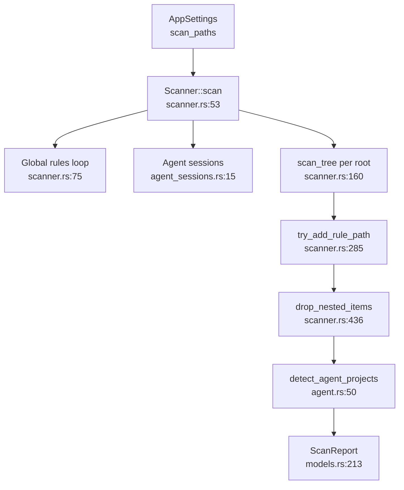

# Scanner Domain

**Module path:** `crates/clv-core/src/scanner.rs`  
**Generated:** 2026-08-22

---

## What This Module Does

The Scanner is the discovery engine of CLV3000 Plus. Before users can review or delete anything, something must walk the filesystem, measure directories, match them against hundreds of cleanup rules, and produce a structured list with risk labels. That is exactly what `Scanner::scan` does—it turns a messy home directory into a `ScanReport` the UI can render.

Without this module, the app would be an empty shell. Every other feature (Cleanup view, Agent view, dashboard totals) depends on the scan pipeline defined here.

---

## Core Capabilities

1. **Global cache discovery** — Iterates `global_cache_rules()` and resolves paths via `resolve_global_path` (`scanner.rs:75-88`).
2. **Agent session injection** — When `include_agent_heuristics` is true, adds paths from `discover_agent_session_targets()` (`scanner.rs:90-98`).
3. **Per-root tree walk** — `WalkDir` with max depth 8, skipping protected and inaccessible paths (`scanner.rs:160-228`).
4. **Rule matching triad** — Directory name, parent name, and project marker file (`rule_matches_dir_name`, `rule_matches_parent`, `rule_matches_marker` at `scanner.rs:448-480`).
5. **Nested deduplication** — `drop_nested_items` removes child hits inside parents like `node_modules/.cache` (`scanner.rs:436-446`).
6. **Agent project tagging** — Post-pass marks items under agent roots as `TechStack::Agent` (`scanner.rs:145-158`).

---

## Key Components

These are the building blocks that turn raw directory walks into curated scan results.

| Component | File path | Responsibility |
|-----------|-----------|----------------|
| `Scanner` | `crates/clv-core/src/scanner.rs:44` | Owns `AppSettings`, runs `scan()` |
| `ProgressThrottle` | `crates/clv-core/src/scanner.rs:21` | Emits progress at most every 300ms |
| `MIN_SCAN_ITEM_BYTES` | `crates/clv-core/src/scanner.rs:19` | 1MB minimum to reduce list noise |
| `dir_size_dir` | `crates/clv-core/src/scanner.rs:381` | Stack-based directory sizing, 100k entry cap |
| `is_agent_project_path` | `crates/clv-core/src/scanner.rs:519` | Name/marker heuristics for agent projects |
| `detect_project_stacks` | `crates/clv-core/src/scanner.rs:540` | Infer TechStack from marker files |

---

## Internal Data Flow

Data enters as `AppSettings` and exits as `ScanReport`. Intermediate steps enrich each path with size, risk, and metadata.

**Key steps:**

1. **Preparing phase** — Emits localized `scan_phase_preparing` (`scanner.rs:64-72`).
2. **Rule path add** — Skips if seen, protected, or under 1MB (`scanner.rs:297-309`). Active projects downgrade Safe→Caution (`scanner.rs:312-317`).
3. **Prune roots** — Matched directories register as prune roots so children are skipped during walk (`scanner.rs:328-331`, `scanner.rs:428-433`).

---

## Key Interfaces and Extension Points

New cleanup targets are added by extending `CleanupRule` entries in `settings.rs`—the Scanner reads rules dynamically via `project_rules()` and `global_cache_rules()`, not hardcoded paths.

Public helpers exported for tests and agent module:
- `rule_matches_dir_name`, `rule_matches_marker`, `is_agent_project_path`, `detect_project_stacks`

---

## Interaction With Other Modules

| Module | Direction | Interface | Description |
|--------|-----------|-----------|-------------|
| Settings | depends | `project_rules`, `global_cache_rules` | Rule catalog |
| Agent sessions | depends | `discover_agent_session_targets` | Session paths |
| Agent | consumed by | `detect_agent_projects` | Post-scan grouping |
| Models | produces | `ScanItem`, `ScanReport` | Output types |
| App store | caller | `Scanner::new(settings).scan` | UI trigger |

---

## Role in Core Business Flows

**In Health Scan:** Scanner runs entirely on a worker thread started by `AppStore::start_scan` (`state.rs:263-268`). Progress callbacks feed the scan bar in `ClvApp` (`app/mod.rs:276-283`).

**In Cleanup:** Scanner does not delete—it only produces the item list that CleanupExecutor later consumes.

---

## Performance Considerations

- Avoids `canonicalize()` to prevent macOS iCloud hangs (`scanner.rs:300` comment).
- Skips VCS dirs: `.git`, `.svn`, `.hg`, `.terrain` (`scanner.rs:379`).
- macOS iCloud paths filtered in `is_inaccessible_path` (`scanner.rs:359-368`).
- Progress throttling prevents UI flood during deep trees.

---

## Implementation Highlights

**Nested item pruning** is a notable design: instead of showing both `node_modules` and `node_modules/.cache`, `drop_nested_items` keeps only the parent (`scanner.rs:436-446`)—tests verify this in `lib.rs:50-86`.

**WalkDir filter_entry** uses `RefCell<HashSet>` for prune roots so sibling rules don't re-enter matched trees (`scanner.rs:172-182`).
