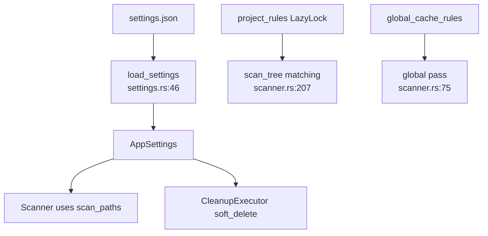

# Settings and Rules Domain

**Module path:** `crates/clv-core/src/settings.rs` (+ `paths.rs` for path helpers)  
**Generated:** 2026-08-22

---

## What This Module Does

`settings.rs` is the encyclopedia of what CLV3000 Plus knows how to clean. It defines `AppSettings` persistence and a large static catalog of `CleanupRule` entries—each describing a directory name pattern, required project marker, risk level, and human description. Without this file, the Scanner would have no targets.

`paths.rs` complements it with default scan roots, protected system path logic, and environment-variable path expansion for Windows global caches.

---

## Core Capabilities

1. **Settings I/O** — JSON load/save at `com.clv3000.plus` config dir (`settings.rs:46-80`).
2. **Project rules** — 60+ project-relative patterns in `LazyLock` vec (`settings.rs:173-639`).
3. **Global cache rules** — Platform-specific (`#[cfg(windows)]` vs non-Windows) (`settings.rs:642-1071`).
4. **Agent heuristics config** — `agent_marker_files`, `agent_name_patterns` (`settings.rs:1073-1107`).
5. **Project markers** — Maps files like `Cargo.toml` to `TechStack` (`settings.rs:1109-1134`).
6. **Protected paths** — Delegates to `paths::is_protected_system_path` (`settings.rs:89-91`).

---

## Key Components

| Component | File path | Responsibility |
|-----------|-----------|----------------|
| `AppSettings` | `crates/clv-core/src/settings.rs:11` | All user preferences |
| `CleanupRule` | `crates/clv-core/src/settings.rs:94` | Matcher definition struct |
| `project_rules` | `crates/clv-core/src/settings.rs:173` | Project-scoped rules |
| `global_cache_rules` | `crates/clv-core/src/settings.rs:642` | Home-dir global caches |
| `default_scan_paths` | `crates/clv-core/src/paths.rs:8` | OS-specific default roots |
| `resolve_global_path` | `crates/clv-core/src/paths.rs:52` | `$LOCALAPPDATA` etc. |
| `is_protected_system_path` | `crates/clv-core/src/paths.rs:146` | Block system dirs |

---

## CleanupRule Builder Pattern

Rules use const builders (`settings.rs:110-171`):

```rust
CleanupRule::project("target", TechStack::Rust, RiskLevel::Safe, ...)
    .marker("Cargo.toml")
```

Supports `.prefix("cmake-build-")`, `.parent("vendor")` for nested patterns.

---

## Internal Data Flow



---

## Interaction With Other Modules

Every core module depends on settings: Scanner (rules + paths), Cleanup (soft delete), App (persistence), Scanner agent helpers (markers).

---

## Extension Guide

To add a new stack's build output:
1. Add `CleanupRule::project(...)` in `project_rules()` vec.
2. Optionally add marker to `project_marker_files()`.
3. No Scanner code changes required if rule fields suffice.

---

## Implementation Highlights

Windows global rules include TEMP, CrashDumps, DeliveryOptimization cache—broader than macOS list (`settings.rs:911-960` vs `967-1067`). `LazyLock` defers large vec initialization until first scan.

Protected Windows paths block `Windows`, `Program Files`, `ProgramData` roots but allow user TEMP (`paths.rs:177-211`).
