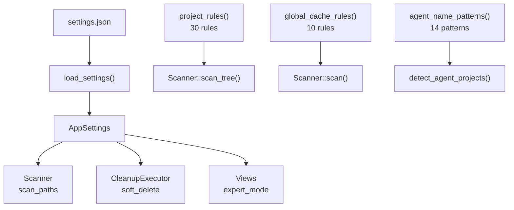

# Settings Domain

**Module Path**: `crates/clv-core/src/settings.rs`
**Generated Date**: 2026-08-20

---

## Overview

Settings is the "brain" of CLV3000 Plus -- not in the sense of intelligence, but in the sense that it defines all the knowledge the application operates with. It's a combination of two things: user preferences (which directories to scan, whether to use soft-delete) and the entire library of cleanup rules (30+ rules covering 13 tech stacks). If the scanner is a detective, the settings module is the detective's notebook full of case files.

The cleanup rules are static data, not user-editable configuration. They encode expert knowledge about what's safe to delete across different frameworks. This is a deliberate choice: exposing rules to users would create a maintenance burden. Instead, the rules evolve with new app versions.

---

## Core Functionality

1. **Settings Persistence** -- Load/save `AppSettings` to JSON in platform-standard config directory.

2. **Cleanup Rule Database** -- 30 project-level rules + 10 global cache rules covering 13 tech stacks.

3. **Agent Detection Patterns** -- 14 name patterns + 7 marker files for identifying AI agent experiments.

4. **Protected System Paths** -- OS-critical paths that must never be scanned or deleted.

5. **Path Utilities** -- `settings_path()`, `trash_dir()`, `is_protected_system_path()`.

---

## Key Components

| Component / Type | File Path | Responsibility |
|-----------------|-----------|---------------|
| `AppSettings` | `crates/clv-core/src/settings.rs:6` | User preferences (8 fields) |
| `settings_path()` | `crates/clv-core/src/settings.rs:42` | Config file location |
| `load_settings()` | `crates/clv-core/src/settings.rs:47` | Read JSON, fallback to defaults |
| `save_settings()` | `crates/clv-core/src/settings.rs:57` | Write JSON |
| `trash_dir()` | `crates/clv-core/src/settings.rs:69` | Trash directory location |
| `is_protected_system_path()` | `crates/clv-core/src/settings.rs:75` | OS-critical path check |
| `CleanupRule` | `crates/clv-core/src/settings.rs:99` | Rule struct |
| `project_rules()` | `crates/clv-core/src/settings.rs:109` | 30 project cleanup rules |
| `global_cache_rules()` | `crates/clv-core/src/settings.rs:338` | 10 global cache rules |
| `agent_name_patterns()` | `crates/clv-core/src/settings.rs:423` | 14 agent name patterns |
| `agent_marker_files()` | `crates/clv-core/src/settings.rs:442` | 7 agent marker files |
| `project_marker_files()` | `crates/clv-core/src/settings.rs:454` | 14 project type markers |

---

## Internal Data Flow

---

## Key Interfaces and Extension Points

This module IS the extension point:
- **New cleanup target**: Add to `project_rules()` or `global_cache_rules()`
- **New agent pattern**: Add to `agent_name_patterns()` or `agent_marker_files()`
- **New project type**: Add to `project_marker_files()`
- **New protected path**: Add to `blocked` array in `is_protected_system_path()`

---

## Interactions with Other Modules

| Interaction Module | Direction | Interface | Description |
|-------------------|-----------|-----------|-------------|
| scanner | Provides to | `project_rules()`, `global_cache_rules()`, `AppSettings` | Rules drive scanning |
| cleanup | Provides to | `AppSettings.soft_delete`, `trash_dir()` | Controls deletion |
| agent | Provides to | `agent_name_patterns()`, `agent_marker_files()` | Detection patterns |
| app (state.rs) | Provides to | `load_settings()`, `save_settings()` | Settings lifecycle |

---

## Implementation Highlights

The `CleanupRule` struct's `global` field distinguishes "apply within project directories" from "apply in the home directory." This prevents looking for `node_modules` in the home directory or `.cargo/registry/cache` inside individual projects.

The `is_protected_system_path()` function's special handling of `/var/folders/` (explicitly NOT blocking it) shows awareness of macOS's temp directory structure.
