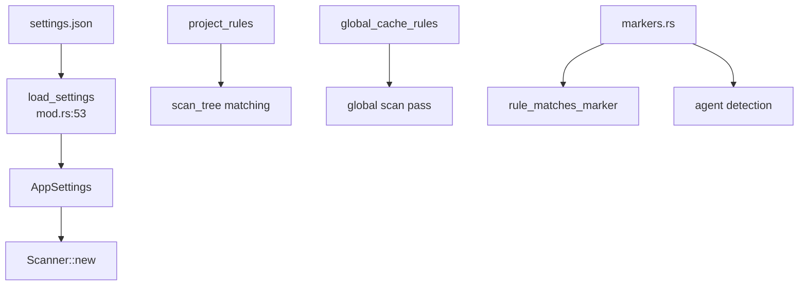

# Settings Domain

**Module path:** `crates/clv-core/src/settings/`  
**Generated:** 2026-08-23

---

## What This Module Does

Settings is the rulebook and preferences layer. It answers two questions: **what should the scanner look for?** (hundreds of `CleanupRule` entries) and **what does the user want?** (`AppSettings` JSON). Without this module, scan roots would be hardcoded, rule descriptions would be inconsistent across languages, and cleanup behavior could not be tuned per user.

---

## Core Capabilities

1. **Settings persistence** — `load_settings` / `save_settings` (`mod.rs:53–78`) read/write JSON at `settings_path()`.

2. **Project rules** — `project_rules.rs` — directory patterns inside projects: `target`, `node_modules`, `.gradle`, `DerivedData`, `cmake-build-*`, `*.egg-info`, etc.

3. **Global rules** — `global_rules.rs` — tool caches under home or Windows env paths (`$LOCALAPPDATA/...`).

4. **Rule structure** — `CleanupRule` in `rule.rs` — relative path, `TechStack`, `RiskLevel`, `CleanupCategory`, `RuleDescription`, optional marker/prefix/parent constraints.

5. **Markers** — `markers.rs` — `project_marker_files`, `agent_marker_files`, `agent_name_patterns` for gating and agent detection.

6. **Path helpers** — `parse_scan_paths`, `format_scan_paths` (`mod.rs:63–76`) for settings UI multiline editor.

---

## Key Components

| Component | File path | Responsibility |
|-----------|-----------|----------------|
| `AppSettings` | `settings/mod.rs:18` | User preferences struct |
| `CleanupRule` | `settings/rule.rs` | Single cleanup rule definition |
| `project_rules` | `settings/project_rules.rs` | In-project patterns (~100+ rules) |
| `global_cache_rules` | `settings/global_rules.rs` | Global cache locations |
| `markers` | `settings/markers.rs` | Marker files and name patterns |
| `resolve_global_path` | `paths.rs:52` | Env-prefix path resolution |
| `settings_path` | `settings/mod.rs:48` | Config file location |

---

## Internal Data Flow

---

## Cross-Module Interactions

| Module | Direction | Interface | Notes |
|--------|-----------|-----------|-------|
| scanner | consumed by | `project_rules()`, `global_cache_rules()` | Every scan |
| cleanup | consumed by | `AppSettings`, `trash_dir` | Mode flags |
| app-store | holds | `AppSettings` | Live copy in store |
| views | edits | SettingsView saves | `save_settings` |
| messages | links | `RuleDescription` on each rule | i18n IDs |

---

## Maintainer Workflow

From `AGENTS.md`:

1. Add `CleanupRule::project(...)` with Chinese placeholder description
2. Append translation in `scripts/rule-description-translations.json`
3. `python3 scripts/generate-rule-descriptions.py --patch`
4. `cargo test -p clv-core`

**Never** hand-edit `rule_description.rs` (AUTO-GENERATED).

---

## Implementation Highlights

`AppSettings::default()` (`mod.rs:32–45`) sets conservative defaults: soft-delete on, expert off, agent heuristics on, default scan paths from `default_scan_paths()` in `paths.rs`.

Windows-specific global rules use `#[cfg(target_os = "windows")]` blocks in `global_rules.rs`.
