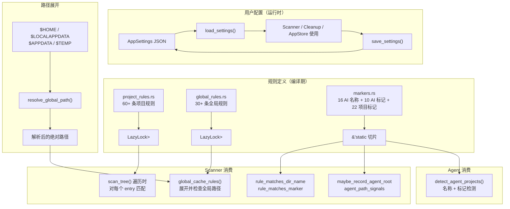

# Settings — 规则与配置中心

## 这个模块在做什么

Settings 是 CLV3000 Plus 的"法规全书"。如果 Scanner 是清运车，那 Settings 就是那本厚厚的法规手册——它定义了什么算垃圾、什么算危险品、什么算受保护资产。整本法规手册分为三大部分：项目规则（`project_rules`）、全局缓存规则（`global_rules`）和标记定义（`markers`），外加一个用户偏好配置文件（`AppSettings`）。

项目规则是最庞大的一章，包含 60+ 条规则，覆盖 Rust（`target/`）、Node/Web（`node_modules/`、`.next/`、`.turbo/` 等 15+ 种构建缓存）、Python（`__pycache__/`、`.venv/`、`.tox/`）、Go（`vendor/`）、Ruby（`vendor/bundle`）、Java/Android（`.gradle/`、`build/`）、iOS（`Pods/`、`DerivedData/`）、Flutter（`.dart_tool/`）、.NET（`bin/`、`obj/`）、C++（`cmake-build-*/`）、Unity（`Library/`、`Temp/`）、Godot（`.godot/`）、Terraform（`.terraform/`）、Elixir（`_build/`）等技术栈。每条规则通过 Builder 模式组装：`.marker("Cargo.toml")` 声明匹配前提、`.prefix("cmake-build-")` 声明前缀通配、`.parent("vendor")` 声明父目录约束。

全局缓存规则是第二章，包含 30+ 条规则（分平台），覆盖 `~/.cargo/registry/cache`、`~/.npm/_cacache`、`~/.gradle/caches`、`~/.m2/repository` 等用户主目录下的共享缓存。Windows 和非 Windows 平台各有独立的规则列表（通过 `#[cfg]` 条件编译），确保路径格式和环境变量展开逻辑正确。

标记定义是第三章，提供 16 个 AI 工具名称模式（`agent_name_patterns()`）、10 个 AI 标记文件（`agent_marker_files()`）和 22 个项目标记文件（`project_marker_files()`），这些标记被 Scanner 的规则匹配管线和 Agent 的识别逻辑共同使用。

`AppSettings` 是用户可配置的偏好集合，包括扫描路径、专家模式、软删除开关、软删除天数、AI 启发式开关、自动扫描、语言和主题偏好。它通过 JSON 文件持久化在应用的配置目录中。

## 核心功能点

1. **编译期静态规则表** — `project_rules()` 和 `global_cache_rules()` 使用 `LazyLock<Vec<CleanupRule>>` 实现延迟初始化的静态规则表。规则在首次调用时构建一次，后续调用零开销。这比运行时解析配置文件快几个数量级。
2. **Builder 模式规则组装** — `CleanupRule` 提供 `project()` / `global()` 构造器 + `.marker()` / `.prefix()` / `.parent()` 链式方法，让规则定义既有类型安全又具可读性。例如 `.marker("Cargo.toml")` 声明"只有当项目根目录存在 Cargo.toml 时才匹配"。
3. **平台条件编译** — `global_cache_rules()` 通过 `#[cfg(target_os = "windows")]` 和 `#[cfg(not(target_os = "windows"))]` 提供两套独立规则列表，覆盖 Windows 的 `$LOCALAPPDATA`、`$APPDATA` 路径和 macOS/Linux 的 `Library/`、`.cache/` 路径。
4. **环境变量路径展开** — `resolve_global_path()` 支持 `$HOME`、`$LOCALAPPDATA`、`$APPDATA`、`$TEMP` 等环境变量在规则路径中的展开，确保规则定义与平台无关。
5. **`AppSettings` 持久化** — `load_settings()` / `save_settings()` 将用户配置以 JSON 格式存储在 `ProjectDirs::from("com", "clv3000", "plus")` 返回的配置目录中，首次启动时自动使用默认值。
6. **扫描历史持久化** — `load_last_scan()` / `save_last_scan()` 将最近一次扫描结果序列化为 JSON，重启应用后可立即展示上次扫描结果，无需重新扫描。
7. **标记文件系统** — `agent_name_patterns()`（16 个关键词）、`agent_marker_files()`（10 个文件名）、`project_marker_files()`（22 个文件-技术栈对）三套标记被 Scanner 和 Agent 模块共同使用，是规则匹配和 AI 识别的基础设施。
8. **受保护路径定义** — `is_protected_system_path()` 检查路径是否属于系统关键目录（如 `/`、`/System`、`C:\Windows` 等），在 Scanner 和 Cleanup 中双重调用，构成安全底线。

## 关键组件

| 组件/类型 | 文件路径 | 一句话职责 |
|-----------|----------|-----------|
| `CleanupRule` | `crates/clv-core/src/settings/rule.rs:7` | 清理规则定义结构体，含路径模式、技术栈、风险等级和匹配条件 |
| `AppSettings` | `crates/clv-core/src/settings/mod.rs:17` | 用户可配置的应用偏好集合，支持 JSON 持久化 |
| `project_rules()` | `crates/clv-core/src/settings/project_rules.rs:7` | 返回 60+ 条项目级清理规则的静态引用 |
| `global_cache_rules()` | `crates/clv-core/src/settings/global_rules.rs:7` | 返回 30+ 条全局缓存规则的静态引用（分平台） |
| `agent_name_patterns()` | `crates/clv-core/src/settings/markers.rs:3` | 返回 16 个 AI 工具名称关键词的静态切片 |
| `agent_marker_files()` | `crates/clv-core/src/settings/markers.rs:24` | 返回 10 个 AI 标记文件名的静态切片 |
| `project_marker_files()` | `crates/clv-core/src/settings/markers.rs:39` | 返回 22 个项目标记文件-技术栈对的静态切片 |
| `load_settings()` | `crates/clv-core/src/settings/mod.rs:53` | 从 JSON 文件加载应用配置，失败时返回默认值 |
| `save_settings()` | `crates/clv-core/src/settings/mod.rs:78` | 将应用配置序列化为 JSON 并写入磁盘 |
| `trash_dir()` | `crates/clv-core/src/settings/mod.rs:90` | 返回 Cleanup 模块使用的临时文件存储目录路径 |

## 内部数据流

## 关键接口与扩展点

- **`CleanupRule::project(relative, stack, risk, category, description)`** — 项目规则构造器。新增项目清理规则只需添加一行 `CleanupRule::project(...)` 调用并链式附加 `.marker()` / `.prefix()` / `.parent()`。
- **`CleanupRule::global(relative, stack, risk, category, description)`** — 全局规则构造器。新增全局缓存规则同理，注意分平台的 `#[cfg]` 条件编译。
- **`CleanupRule::marker(self, marker)`** — 标记文件约束。`.marker("package.json")` 表示"只有当项目根目录存在 package.json 时才匹配此规则"。
- **`CleanupRule::prefix(self, prefix)`** — 前缀/后缀通配。`.prefix("cmake-build-")` 匹配所有以此为前缀的目录名；`.prefix("*.egg-info")` 匹配以此为后缀的目录名。
- **`AppSettings` 的字段** — 新增用户可配置项只需在此结构体中添加字段并提供 `serde(default)` 值，UI 层的 Settings 页面需同步添加对应控件。
- **`agent_name_patterns()` / `agent_marker_files()`** — 新增 AI 工具支持只需在对应列表中追加条目，Scanner 和 Agent 模块会自动使用新条目。

## 与其他模块的交互

| 交互模块 | 交互内容 | 说明 |
|----------|----------|------|
| `scanner` | `project_rules()`, `global_cache_rules()`, `agent_marker_files()`, `is_protected_system_path()` | Scanner 从 Settings 获取全部规则和标记定义 |
| `agent` | `agent_name_patterns()`, `agent_marker_files()`, `detect_project_stacks()` | Agent 模块使用标记定义进行 AI 项目识别 |
| `cleanup` | `AppSettings.soft_delete`, `AppSettings.expert_mode`, `trash_dir()` | Cleanup 根据配置决定软/硬删除模式和受保护项跳过行为 |
| `app-state` | `load_settings()`, `save_settings()`, `AppSettings` | UI 层读写用户配置 |
| `locale` | `LanguagePreference`, `ThemePreference` | Settings 中存储的语言和主题偏好 |
| `paths` | `default_scan_paths()`, `expand_scan_path()`, `resolve_global_path()` | Settings 使用路径工具函数解析默认扫描路径和环境变量 |

## 跨模块协作场景

**场景一：规则匹配管线**
Scanner 遍历 `~/projects/my-app/` 时发现目录名 `target`。它调用 `rule_matches_dir_name("target", rule)` 发现与 Rust 规则的 `relative: "target"` 精确匹配。然后调用 `rule_matches_parent()` 检查无父目录约束（返回 true）。最后调用 `rule_matches_marker(project_root, rule)` 检查项目根目录是否存在 `Cargo.toml`。三项全部通过后，Scanner 将该目录标记为清理候选。

**场景二：平台差异化规则**
在 macOS 上编译时，`global_cache_rules()` 返回的规则列表包含 `Library/Caches/pnpm`、`Library/Developer/Xcode/DerivedData` 等 macOS 特有路径。在 Windows 上，同一函数返回包含 `$LOCALAPPDATA/npm-cache/_cacache`、`$APPDATA/Code/Cache` 等 Windows 特有路径。`resolve_global_path()` 负责展开路径中的环境变量。

**场景三：配置持久化与恢复**
用户在 Settings 页面切换"专家模式"开关后，`save_settings()` 将当前 `AppSettings` 序列化为 JSON 写入磁盘。下次启动时，`load_settings()` 读取 JSON 并反序列化。如果文件不存在或格式错误，自动返回 `AppSettings::default()`（专家模式关闭、软删除开启、7 天保留期）。

## 性能考量

- **LazyLock 延迟初始化**：`project_rules()` 和 `global_cache_rules()` 的规则表使用 `std::sync::LazyLock`，仅在首次调用时构建。由于规则数量固定（60+30 条），构建时间在微秒级，后续调用为纯引用传递。
- **静态切片引用**：`agent_name_patterns()` 和 `agent_marker_files()` 返回 `&'static [&'static str]`，零分配、零拷贝，Scanner 在遍历时直接引用。
- **JSON 序列化效率**：`AppSettings` 和 `ScanReport` 使用 `serde_json` 的 `to_string_pretty()` / `from_str()`，对于典型配置文件（< 1KB）和扫描报告（< 100KB）来说，序列化/反序列化耗时在毫秒级。
- **条件编译零运行时开销**：`global_cache_rules()` 的平台分支在编译期确定，运行时只有一个分支的代码被编译进二进制，不会产生 match 或 if-else 开销。
- **Builder 模式编译期求值**：`CleanupRule::project()` 和链式方法均为 `const fn`，理论上可在编译期完成规则构建（虽然当前使用 `LazyLock` 在运行时初始化）。
