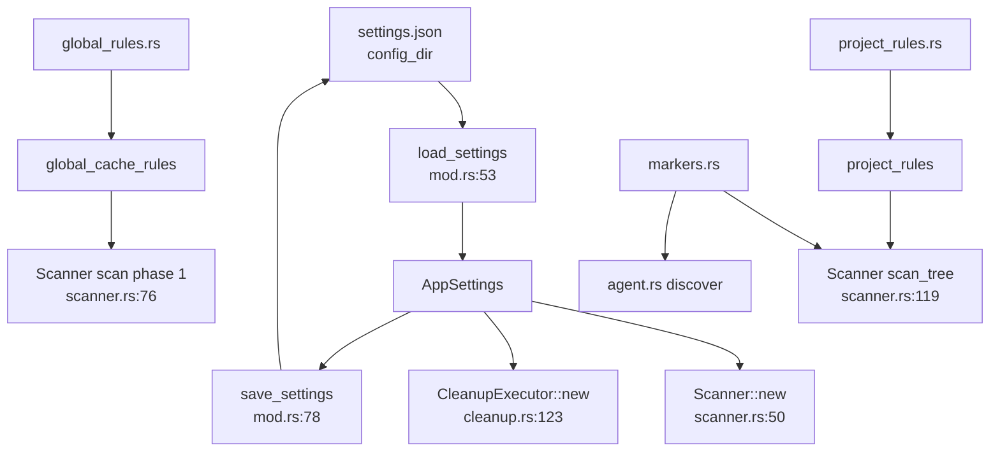

# Settings Domain

**Module path:** `crates/clv-core/src/settings/`  
**Generated:** 2026-08-26

---

## What This Module Does

The settings module is the app's rulebook and configuration center. It defines what `AppSettings` the user can tune, where those preferences are saved on disk, and—most importantly—the extensive `CleanupRule` catalog that tells the scanner what to look for across Rust, Node, Python, Android, mobile, and AI agent toolchains.

Think of it as the product's DNA: adding a new cleanup target is usually a data change in `project_rules.rs` or `global_rules.rs`, not a scanner algorithm rewrite. The rule builder API in `rule.rs` keeps hundreds of entries consistent and composable.

---

## Core Capabilities

1. **User preferences** — `AppSettings` (`settings/mod.rs:18-30`) holds scan roots, expert/soft-delete flags, language, theme, and onboarding state with serde JSON persistence.

2. **Rule catalog** — `CleanupRule` (`rule.rs:7-20`) defines relative paths, stack, risk, category, description, and optional marker/prefix/parent constraints.

3. **Global cache rules** — `global_cache_rules()` in `global_rules.rs` targets home-level paths like `.cargo/registry`, npm cache, Gradle caches.

4. **Project rules** — `project_rules()` in `project_rules.rs` targets per-project dirs like `target/`, `node_modules/`, `build/`, `DerivedData/`.

5. **Marker definitions** — `markers.rs` lists project marker files (`Cargo.toml`, `package.json`) and agent markers (`.cursor`, `AGENTS.md`).

6. **Path resolution** — `resolve_global_path`, `expand_scan_path`, and `default_scan_paths` in `paths.rs` translate user-friendly paths to OS-specific locations.

7. **Trash directory** — `trash_dir()` (`settings/mod.rs:90-93`) resolves soft-delete quarantine under `data_local_dir()/trash`.

---

## Key Components

| Component | File path | Responsibility |
|-----------|-----------|----------------|
| `AppSettings` | `settings/mod.rs:18-30` | User configuration struct |
| `load_settings` / `save_settings` | `settings/mod.rs:53-88` | JSON persistence to config dir |
| `settings_path` | `settings/mod.rs:48-51` | Resolves `settings.json` location |
| `CleanupRule` | `settings/rule.rs:7-82` | Rule definition with builder methods |
| `global_cache_rules` | `settings/global_rules.rs` | Home/env cache rule list |
| `project_rules` | `settings/project_rules.rs` | Per-project build/cache rules |
| `agent_marker_files` | `settings/markers.rs` | Agent detection marker list |
| `project_marker_files` | `settings/markers.rs` | Project root detection markers |
| `trash_dir` | `settings/mod.rs:90-93` | Soft-delete destination path |
| `is_protected_system_path` | `settings/mod.rs:96-98` | Delegates to `paths.rs` guards |

---

## Internal Data Flow



**Key steps**

1. **App launch** — `main.rs` calls `load_settings()` before GPUI init.
2. **Scan** — Scanner reads `scan_paths`, `include_agent_heuristics`, and pulls rule lists from settings submodules.
3. **Settings UI** — `SettingsView` mutates `AppStore.settings` and calls `save_settings` on change.
4. **Onboarding** — `finish_onboarding` updates paths and `onboarding_done`, then persists (`state.rs:471`).

---

## Key Interfaces and Extension Points

**CleanupRule builder API**

```rust
CleanupRule::project("target", TechStack::Rust, RiskLevel::Safe, category, desc)
    .marker("Cargo.toml")

CleanupRule::global(".cargo/registry", TechStack::Rust, RiskLevel::Caution, category, desc)
    .prefix("cmake-build-")
    .parent("vendor")
```

Defined in `rule.rs:23-82`. Chain `.marker()`, `.prefix()`, `.parent()` for conditional matching.

**Add a new stack target**

1. Add rule entry in `project_rules.rs` or `global_rules.rs`.
2. If new `TechStack` variant needed, extend enum in `models.rs:9-28`.
3. Add `RuleDescription` variant in `messages/rule_description.rs` for i18n.

No scanner code change required for standard path-based rules.

---

## Interactions With Other Modules

| Module | Direction | Interface | Notes |
|--------|-----------|-----------|-------|
| Scanner | consumed by | `global_cache_rules`, `project_rules`, `AppSettings` | Rule source for all scan phases |
| Cleanup | consumed by | `AppSettings`, `trash_dir` | Soft-delete behavior |
| Agent | consumed by | `agent_marker_files`, `scan_paths` | Marker and walk root config |
| Paths | dependency | `default_scan_paths`, `resolve_global_path` | Cross-platform path helpers |
| Locale | dependency | `LanguagePreference`, `ThemePreference` | UI prefs in settings struct |
| AppStore | owner | `settings: AppSettings` | Central mutable config in UI |
| Views | consumer | `SettingsView`, `OnboardingView` | User-facing config editors |

---

## Role in Core Business Flows

**Health scan flow** — `AppSettings` cloned into worker thread at `start_scan` (`state.rs:299`); scanner applies `global_cache_rules()` then `project_rules()` per tree walk.

**Risk-gated defaults** — Rule `risk` field flows into `ScanItem.risk`; `default_selected_item_ids` (`models.rs:101-107`) selects only `RiskLevel::Safe`.

**Expert mode unlock** — `expert_mode: false` by default (`mod.rs:36`); toggling in settings exposes protected rules/items in UI and cleanup executor.

---

## Performance Considerations

- Rule lists are static `const` arrays—no runtime rule compilation.
- `load_settings` is called at startup and on explicit save—not per scan item.
- `parse_scan_paths` / `format_scan_paths` (`mod.rs:63-76`) used only in settings UI text fields.
- Protected path checks delegated to `paths.rs` for centralized guard logic.

---

## Implementation Highlights

**Rule prefix/suffix matching** — `relative_prefix` supports `cmake-build-*` and `*.egg-info` patterns; tested in `lib.rs:127-158`.

**Marker-gated rules** — `.gradle` build dirs only match when `build.gradle` or `settings.gradle` exists under project root—prevents false positives in random folders.

**Global vs project scope** — `CleanupRule::global` vs `::project` determines whether `resolve_global_path` or project-relative resolution applies in scanner.

**Sensible defaults** — `soft_delete: true`, `include_agent_heuristics: true`, `expert_mode: false` (`mod.rs:34-39`) optimize for safe first-run experience.
