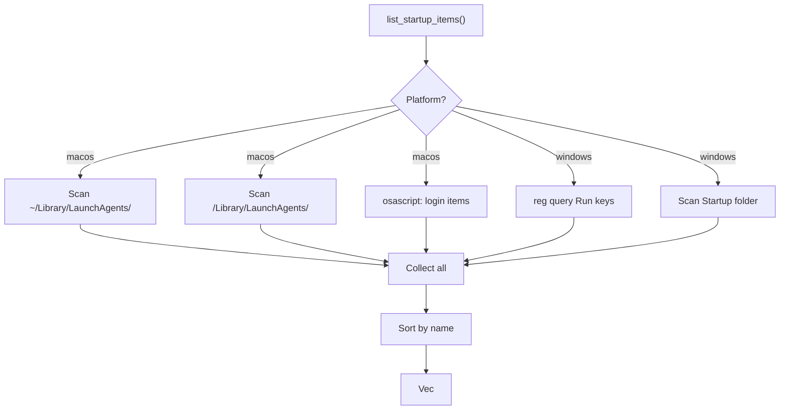

# Platform Startup Domain

**Module Path**: `crates/clv-platform/src/startup.rs`
**Generated Date**: 2026-08-20

---

## Overview

The Startup module manages programs that automatically start when your computer boots. Every app installation often sneaks a "LaunchAgent" or registry entry into your startup configuration. Over time, these accumulate and slow down boot time. This module gives users visibility and control.

It handles two very different OS platforms: macOS uses plist files and osascript, while Windows uses the registry and the Startup folder. The module abstracts these behind a common `StartupItem` interface.

---

## Core Functionality

1. **macOS**: Scans `~/Library/LaunchAgents/` and `/Library/LaunchAgents/` for `.plist` files. Queries login items via `osascript`.

2. **Windows**: Queries `HKCU\...\Run` and `HKLM\...\Run` registry keys. Scans the Startup folder.

3. **Toggling**: macOS LaunchAgents: rename `.plist` ↔ `.plist.disabled`. Windows Startup Folder: delete the file. Login items and registry: not supported in v0.1.

4. **Impact Assessment**: Docker, Spotify, Steam, Dropbox = High. "update"/"helper" = Medium. Everything else = Low.

---

## Key Components

| Component / Type | File Path | Responsibility |
|-----------------|-----------|---------------|
| `StartupImpact` | `crates/clv-platform/src/startup.rs:5` | Impact level enum |
| `StartupKind` | `crates/clv-platform/src/startup.rs:22` | Entry type (7 variants) |
| `StartupItem` | `crates/clv-platform/src/startup.rs:47` | Data struct |
| `list_startup_items()` | `crates/clv-platform/src/startup.rs:57` | Platform-dispatched enumeration |
| `set_startup_enabled()` | `crates/clv-platform/src/startup.rs:72` | Platform-dispatched toggle |
| `macos::list_startup_items()` | `crates/clv-platform/src/startup.rs:93` | macOS implementation |
| `windows::list_startup_items()` | `crates/clv-platform/src/startup.rs:217` | Windows implementation |

---

## Internal Data Flow

---

## Interactions with Other Modules

| Interaction Module | Direction | Interface | Description |
|-------------------|-----------|-----------|-------------|
| views (startup.rs) | Called by | `list_startup_items()`, `set_startup_enabled()` | UI display and toggle |
| app (state.rs) | Called by | `list_startup_items()` at init | Dashboard stat |

---

## Implementation Highlights

The macOS `guess_impact()` heuristic assumes Docker, Spotify, and Steam are "high impact" based on real-world behavior. The `set_startup_enabled()` function's refusal to toggle macOS login items (directing to System Settings) is an honest admission of limitation.
