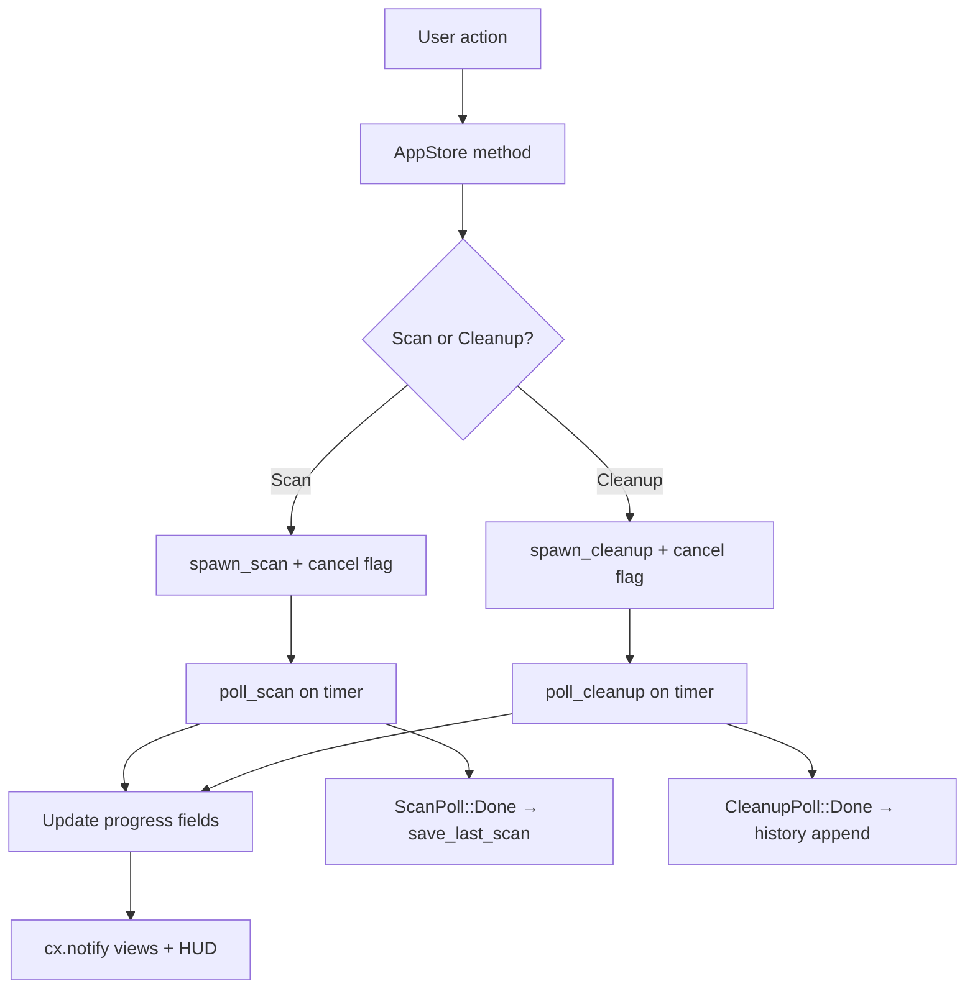

# AppStore (State) Domain

**Module path:** `crates/clv-app/src/app/state.rs`  
**Generated:** 2026-08-28

---

## What This Module Does

AppStore is the control tower every view watches. Instead of each page maintaining its own copy of scan results or spawning its own background jobs, everything flows through one GPUI `Entity<AppStore>`. When scan progress ticks or cleanup completes, `cx.notify()` propagates updates to all subscribed views and the ProgressHud overlay.

Think of it as the app's **single source of truth**—the architectural guardrail that prevents inconsistent UI state.

---

## Core Capabilities

1. **Centralized state** — Settings, `last_report`, selection IDs, progress fields, cleanup history (`state.rs:64-92`).

2. **Scan orchestration** — `start_scan`, `cancel_scan`, `poll_scan_loop` coordinating with `services/scan.rs`.

3. **Cleanup orchestration** — `run_cleanup`, cancel handling, post-cleanup report merge and agent re-detection.

4. **Restore support** — `restore_trashed_entry` calls `restore_trashed` and updates history.

5. **Disk usage refresh** — Async `primary_disk_usage` via platform adapter, updates tray tooltip.

---

## Key Components

| Component | File path | Responsibility |
|-----------|-----------|----------------|
| `AppStore` | `crates/clv-app/src/app/state.rs:64` | Central state entity |
| `AppPage` | `crates/clv-app/src/app/state.rs:23` | Page routing enum |
| `CleanupFilter` | `crates/clv-app/src/app/state.rs:55` | Cleanup view bucket filter |
| `start_scan` | `crates/clv-app/src/app/state.rs` | Initiates background scan |
| `run_cleanup` | `crates/clv-app/src/app/state.rs` | Initiates background cleanup |
| `spawn_scan` | `crates/clv-app/src/services/scan.rs:20` | Thread + channel setup |
| `spawn_cleanup` | `crates/clv-app/src/services/cleanup.rs` | Thread + channel setup |
| `ProgressHud` attachment | `crates/clv-app/src/app/state.rs:150` | Links overlay entity |

---

## Internal Data Flow

---

## Cross-Module Interactions

| Module | Direction | Interface | Notes |
|--------|-----------|-----------|-------|
| All Views | Observed by | `Entity<AppStore>` | Read-only via `store.read(cx)` |
| Scanner | Invoked via | `services/scan.rs` | Never called directly from views |
| Cleanup | Invoked via | `services/cleanup.rs` | Same pattern |
| Platform | Calls | `primary_disk_usage`, `pick_folders` | OS integration |
| Tray | Polled by | `take_scan_request` in ClvApp | Scan from menu bar |

---

## Implementation Highlights

- `default_selected_item_ids` pre-selects Safe-risk items after scan (`models.rs:76`).
- `scan_restart_pending` enables immediate re-scan after cancel.
- `pending_cleanup_notification` queues success message for ClvApp to display.
- Background `purge_old_trash` on startup prevents stale trash accumulation.
