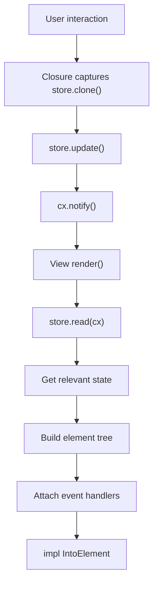

# Views Module

**Module Path**: `crates/clv-app/src/views/`
**Generated Date**: 2026-08-20

---

## Overview

The Views module is the "face" of CLV3000 Plus -- 7 views, each responsible for one screen. They all follow the same pattern: receive `Entity<AppStore>`, read state during `render()`, and update state through closures.

---

## Key Components

| Component | File Path | Responsibility |
|-----------|-----------|---------------|
| `DashboardView` | `crates/clv-app/src/views/dashboard.rs:5` | Stat cards and quick actions |
| `CleanupView` | `crates/clv-app/src/views/cleanup.rs:5` | Filter panel, item list, batch actions |
| `AgentView` | `crates/clv-app/src/views/agent.rs:5` | Agent project cards |
| `StartupView` | `crates/clv-app/src/views/startup.rs:6` | Item list with toggles |
| `ProcessView` | `crates/clv-app/src/views/process.rs:6` | Process table with kill |
| `SettingsView` | `crates/clv-app/src/views/settings.rs:5` | Settings toggles |
| `OnboardingView` | `crates/clv-app/src/views/onboarding.rs:4` | 3-step wizard |

---

## Internal Data Flow

All views follow the same pattern:

---

## Implementation Highlights

The `CleanupView` filter panel offers simple filters (All, Safe Only, Agent) at the top, then per-tech-stack filters below. The `OnboardingView` wizard is deliberately minimal -- no email, no accounts, just mode selection and path preview. The consistent `risk_badge()` across views creates visual consistency with green/yellow/red indicators.
