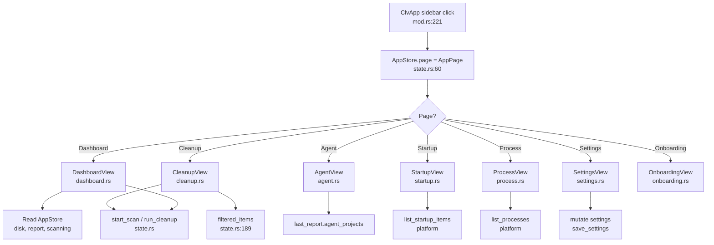

# Views Domain

**Module path:** `crates/clv-app/src/views/`  
**Generated:** 2026-08-26

---

## What This Module Does

The views module is the face of CLV3000 Plus—every page the user sees is a GPUI component that reads from `Entity<AppStore>` and renders a functional area of the app. The dashboard shows health scores and scan buttons; the cleanup page lists reclaimable items with filters; the agent page displays virtualized trial-project cards. Views do not spawn worker threads or walk the filesystem—they delegate all heavy work back to `AppStore` methods.

Lazy creation in `ClvApp` (`app/mod.rs:57-117`) means views are instantiated on first navigation, keeping startup fast for users who only need the dashboard.

---

## Core Capabilities

1. **Dashboard** — `DashboardView` (`dashboard.rs`) shows disk usage, reclaimable space, scan CTA, cleanup history stats, and health score derived from `AppStore` fields.

2. **Cleanup list** — `CleanupView` (`cleanup.rs`) renders filtered `ScanItem` rows with checkboxes, risk badges, search, and sidebar `CleanupFilter` controls.

3. **Agent projects** — `AgentView` (`agent.rs`) virtualizes `AgentProject` cards with stacks, inactive days, reason badges, and "select all project items" actions.

4. **Startup management** — `StartupView` (`startup.rs`) lists boot items from `clv-platform` with enable/disable toggles.

5. **Process monitor** — `ProcessView` (`process.rs`) displays sortable process list with memory/CPU and kill buttons.

6. **Settings editor** — `SettingsView` (`settings.rs`) edits `AppSettings` fields—mode, paths, theme, language, soft-delete options.

7. **Onboarding wizard** — `OnboardingView` (`onboarding.rs`) first-run flow for scan paths and mode selection, calls `finish_onboarding`.

8. **Shared module exports** — `views/mod.rs` re-exports all view structs for `app/mod.rs` imports.

---

## Key Components

| Component | File path | Responsibility |
|-----------|-----------|----------------|
| `DashboardView` | `views/dashboard.rs` | Health score, disk bar, scan/cleanup CTAs |
| `CleanupView` | `views/cleanup.rs` | Item list, selection, filters, search |
| `AgentView` | `views/agent.rs` | Virtualized agent project cards |
| `StartupView` | `views/startup.rs` | Boot item list with toggles |
| `ProcessView` | `views/process.rs` | Process table with sort and kill |
| `SettingsView` | `views/settings.rs` | Preferences editor |
| `OnboardingView` | `views/onboarding.rs` | First-run wizard |
| `mod.rs` | `views/mod.rs` | Module re-exports |
| `ClvApp` | `app/mod.rs:57-117` | Lazy view creation on navigation |
| Sidebar | `app/mod.rs:221-277` | `AppPage` navigation buttons |

---

## Internal Data Flow



**Key steps**

1. **Navigation** — Sidebar sets `store.page`; `ClvApp::render` matches on `AppPage` to show active view.
2. **Lazy init** — First visit creates `Entity<View>` stored in `ClvApp` fields (`mod.rs:57-117`).
3. **State read** — Views call `store.read(cx)` or `store.update(cx, ...)` for actions.
4. **Re-render** — `AppStore` calls `cx.notify()` after state changes; subscribed views repaint.

---

## Key Interfaces and Extension Points

**View pattern (GPUI)**

Each view is typically a struct implementing `Render` with `Entity<AppStore>` (or `ViewContext`) subscription:

```rust
// Conceptual pattern used across views/
pub struct DashboardView {
    store: Entity<AppStore>,
}
impl Render for DashboardView { /* read store, build elements */ }
```

**Add a new view**

1. Create `views/new_page.rs` with GPUI `Render` impl.
2. Export from `views/mod.rs`.
3. Add `AppPage` variant and lazy-init in `ClvApp`.
4. Add sidebar button in `app/mod.rs`.

**Shared UI widgets** — Reusable components live in `crates/clv-app/src/ui/` (buttons, cards, progress bars)—views compose these rather than duplicating styles.

---

## Interactions With Other Modules

| Module | Direction | Interface | Notes |
|--------|-----------|-----------|-------|
| AppStore | dependency | `Entity<AppStore>` | Single source of UI truth |
| i18n | dependency | `I18n` labels | All user-visible strings |
| ui/ | dependency | Shared widgets | Consistent styling |
| clv-platform | direct (Startup/Process) | `list_startup_items`, `list_processes` | OS data for system pages |
| theme | dependency | `ThemePreference` | Visual styling per settings |
| Services | indirect | Via AppStore | Views never call spawn_* directly |

---

## Role in Core Business Flows

**Health scan flow** — `DashboardView` scan button → `AppStore::start_scan` → progress bar reads `scan_phase`, `scan_items_found`, `scan_bytes_found` during poll → completion updates dashboard reclaimable stats.

**Cleanup flow** — `CleanupView` shows `filtered_items` with checkboxes → confirm button → `AppStore::run_cleanup` → progress from `cleanup_completed` / `cleanup_total` fields.

**Agent review flow** — `AgentView` renders `agent_projects` cards → user clicks "Clean project" → `select_project_items` + navigate to Cleanup page.

**Onboarding flow** — First launch renders `OnboardingView` instead of dashboard → `finish_onboarding` persists settings and switches to `AppPage::Dashboard`.

---

## Performance Considerations

- **Lazy view creation** — Only instantiated views consume GPUI entity memory.
- **Agent view virtualization** — Large project lists use virtualized scrolling (`agent.rs`) to avoid rendering hundreds of cards at once.
- **Filtered item cloning** — `filtered_items` returns owned `Vec<ScanItem>`—views should not call it excessively per frame; typical GPUI pattern reads once per render.
- **Process/Startup on-demand** — Platform APIs called when view is active or refreshed, not globally at launch.
- **Page transition keys** — `AppPage::transition_key` (`state.rs:35-44`) enables animation without full app rebuild.

---

## Implementation Highlights

**Bilingual rule descriptions** — Cleanup view shows `RuleDescription` via i18n helpers; search uses `rule_description_matches_query` for localized text matching (`state.rs:226`).

**Expert mode UI differences** — Simple mode hides protected items and shows friendlier descriptions; expert mode exposes full paths and technical detail—controlled by `settings.expert_mode` read in views.

**Cleanup filter sidebar** — Five `CleanupFilter` buckets map to `item_cleanup_bucket` logic in models—views only set filter enum, store computes filtered list.

**Notification toast** — Cleanup success notification rendered in `ClvApp` (`mod.rs:162-170`) when `pending_cleanup_notification` is set—decoupled from CleanupView lifecycle.

**Theme integration** — All views respect `ThemePreference` from settings for Defender/Blossom/Neon/Aurora color schemes.
