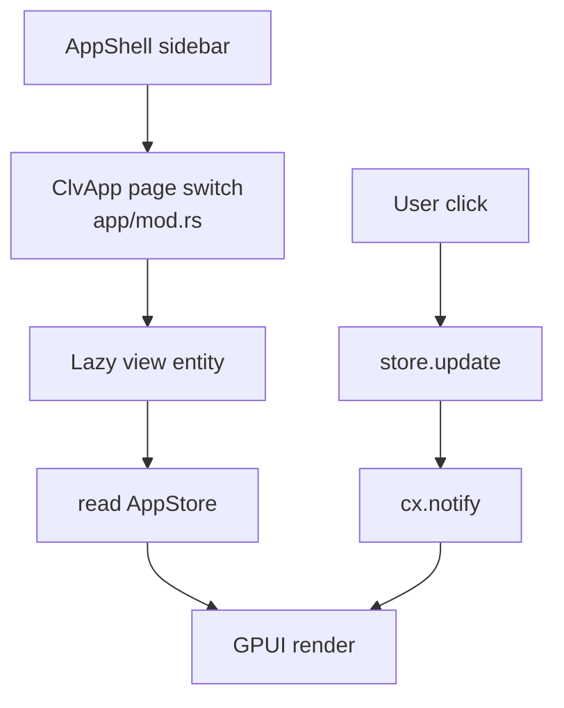

# Views Domain

**Module path:** `crates/clv-app/src/views/`  
**Generated:** 2026-08-23

---

## What This Module Does

Views are the GPUI presentation layer — each file implements one navigable "page" of the application. They render snapshots from `AppStore`, translate typed domain enums into human language via `I18n`, and forward user gestures back to store mutations. `ClvApp` lazily constructs each view on first visit (`app/mod.rs:56–80`), so startup only pays for the onboarding or dashboard page initially.

---

## Core Capabilities

1. **Dashboard** — `dashboard.rs` — Disk usage summary, scan entry point, high-level status from `AppStore` disk fields.

2. **Cleanup** — `cleanup.rs` — Filterable list of `ScanItem`s, risk badges, `rule_description_label`, cleanup confirmation.

3. **Agent** — `agent.rs` — `AgentProject` cards with `format_agent_reason`, search, link to select project items for cleanup.

4. **Startup** — `startup.rs` — Lists OS startup items via `clv-platform::list_startup_items`, toggle enable.

5. **Process** — `process.rs` — Process table from `ProcessEnumerator`, sort, search, kill via `AppStore.kill_process_pid`.

6. **Settings** — `settings.rs` — Scan paths editor, expert/soft-delete toggles, theme, language; saves via `save_settings`.

7. **Onboarding** — `onboarding.rs` — First-run flow; sets `onboarding_done`.

---

## Key Components

| Component | File path | Responsibility |
|-----------|-----------|----------------|
| `DashboardView` | `views/dashboard.rs` | Home / disk overview |
| `CleanupView` | `views/cleanup.rs` | Main cleanup UI |
| `AgentView` | `views/agent.rs` | Agent experiment browser |
| `StartupView` | `views/startup.rs` | Startup item manager |
| `ProcessView` | `views/process.rs` | Process list and kill |
| `SettingsView` | `views/settings.rs` | Preferences editor |
| `OnboardingView` | `views/onboarding.rs` | First-run wizard |
| `AppShell` | `app/shell.rs` | Sidebar + page transitions |
| `rule_description_label` | `i18n/labels.rs` | Rule text for UI |
| `theme.rs` | `crates/clv-app/src/theme.rs` | Theme colors |

---

## Internal Data Flow

---

## Expert vs Simple Mode

Controlled by `settings.expert_mode`:

- **Simple** — Plain-language `RuleDescription::text(lang)`; hidden protected items in lists.
- **Expert** — Full filesystem paths; protected items visible; more cleanup categories selectable.

Views consult `AppStore.settings.expert_mode` and `filtered_items` rather than duplicating filter logic.

---

## Cross-Module Interactions

| Module | Direction | Interface | Notes |
|--------|-----------|-----------|-------|
| app-store | depends | `Entity<AppStore>` | All views |
| i18n | depends | `I18n`, labels | Trilingual UI |
| platform | some views | startup, process APIs | StartupView, ProcessView |
| clv-core types | display | `ScanItem`, `AgentProject` | Read-only render |

---

## UI Kit

Shared widgets under `crates/clv-app/src/ui/` — `controls.rs`, `list.rs`, `security.rs` (risk badges), `icons.rs`, `text.rs`. Assets embedded via `assets.rs` and `build.rs`.

---

## Implementation Highlights

Page transition keys on `AppPage::transition_key` (`state.rs:34`) enable shell animations without conflating page identity.

`CleanupView` uses `expanded_item` on store for accordion detail rows (`state.rs:71`).

Agent view search matches `agent_reason_matches_query` in addition to path/name (`lib.rs` exports).
