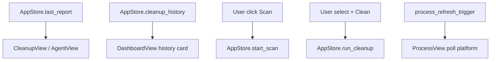

# Views Domain

**Module path:** `crates/clv-app/src/views/`  
**Generated:** 2026-08-28

---

## What This Module Does

Views are the user-facing rooms of the application—each page renders a specific workflow by reading from `AppStore` and dispatching actions back to it. They never touch the filesystem or spawn threads directly; this discipline keeps UI code thin and testable domain logic in `clv-core`.

---

## Core Capabilities

| View | File | Primary workflow |
|------|------|------------------|
| DashboardView | `views/dashboard.rs` | Health score, disk volumes dialog, scan trigger, history/restore |
| CleanupView | `views/cleanup.rs` | Filter/group scan items, select, trigger cleanup |
| AgentView | `views/agent.rs` | Browse agent experiment projects with search |
| LargeFilesView | `views/large_files.rs` | Large files from last scan |
| ProcessView | `views/process.rs` | Process list, search, kill (visibility-aware poll) |
| StartupView | `views/startup.rs` | List/toggle OS startup items |
| SettingsView | `views/settings.rs` | Edit AppSettings, scan paths, mode toggle |
| OnboardingView | `views/onboarding.rs` | First-run setup wizard |

---

## Key Components

| Component | File path | Responsibility |
|-----------|-----------|----------------|
| `DashboardView` | `crates/clv-app/src/views/dashboard.rs` | Main landing page + history card |
| `CleanupView` | `crates/clv-app/src/views/cleanup.rs` | Item checklist with bucket/risk filters |
| `AgentView` | `crates/clv-app/src/views/agent.rs` | Agent project browser |
| `compute_health` | `crates/clv-app/src/theme.rs` | Dashboard health score calculation |
| `hero_banner` | `crates/clv-app/src/theme.rs` | Dashboard hero UI section |
| View exports | `crates/clv-app/src/views/mod.rs` | Module declarations |

---

## Internal Data Flow

---

## Cross-Module Interactions

| Module | Direction | Interface | Notes |
|--------|-----------|-----------|-------|
| AppStore | Read/write | `Entity<AppStore>` | All state mutations via store methods |
| i18n | Uses | `I18n::from_settings` | Page titles, labels |
| UI kit | Uses | list widgets, progress bars, icons | Shared rendering |
| Platform | Via store | process/startup calls triggered from views | Indirect only |

**Simple vs Expert mode**: Views conditionally show paths vs human labels based on `settings.expert_mode`.

---

## Implementation Highlights

- ProcessView uses `process_refresh_trigger` counter for visibility-aware refresh—only polls when page shown.
- CleanupView groups items by `CleanupBucket` derived from `item_cleanup_bucket` (`models.rs:49`).
- AgentView searches across name, `reason_parts`, path, and stack fields.
