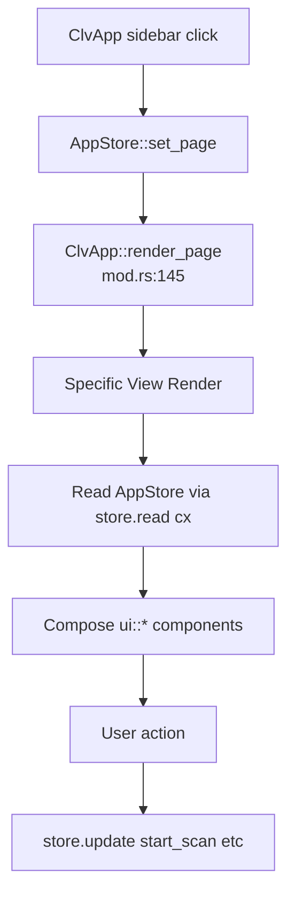

# Views Domain

**Module path:** `crates/clv-app/src/views/`  
**Generated:** 2026-08-22

---

## What This Module Does

Views are GPUI `Render` implementations for each major screen. They do not own business logic— they read `AppStore`, compose `ui` components, and dispatch actions back to the store. `ClvApp` lazily constructs each view entity on first navigation (`app/mod.rs:56-117`), keeping startup light.

---

## View Inventory

| View | File | Primary actions |
|------|------|-----------------|
| `DashboardView` | `views/dashboard.rs` | Health score, disk stats, trigger scan |
| `CleanupView` | `views/cleanup.rs` | Virtualized item list, filters, clean CTA |
| `AgentView` | `views/agent.rs` | Agent project cards, search, navigate to cleanup |
| `StartupView` | `views/startup.rs` | Toggle startup items via platform API |
| `ProcessView` | `views/process.rs` | List processes, kill by PID |
| `SettingsView` | `views/settings.rs` | Mode, paths, theme, language |
| `OnboardingView` | `views/onboarding.rs` | First-run wizard |

Module barrel: `views/mod.rs` exports all view types.

---

## Key Components

| Component | File path | Responsibility |
|-----------|-----------|----------------|
| `DashboardView` | `crates/clv-app/src/views/dashboard.rs:6` | Hero banner, health `compute_health` |
| `CleanupView` | `crates/clv-app/src/views/cleanup.rs:15` | `UniformListScrollHandle`, row height 108px |
| `AgentView` | `crates/clv-app/src/views/agent.rs:13` | Local search + store projects |
| `CleanupView::render_row` | `crates/clv-app/src/views/cleanup.rs:28` | Per-item card with expert path mode |
| `ClvApp::render_page` | `crates/clv-app/src/app/mod.rs:145` | Page → view dispatch |

---

## Internal Data Flow

---

## UI Patterns

**Virtualization:** Cleanup and Agent views use `UniformListScrollHandle` with fixed row heights (`CLEANUP_ROW_H = 108`, `AGENT_ROW_H = 104`) for smooth scrolling over hundreds of items.

**Expert vs Simple:** CleanupView shows full `item.path` in expert mode; otherwise project root or name (`cleanup.rs:39-46`).

**Page transitions:** `ui::page_transition` wraps content with stable keys from `AppPage::transition_key` (`state.rs:38-48`).

---

## Interaction With Other Modules

| Module | Relationship |
|--------|--------------|
| App store | Data + actions |
| ui | Visual components (cards, scan bar, nav icons) |
| i18n | `I18n` from store for all labels |
| theme | `colors`, `corner` for styling |
| clv-core | `ScanItem`, `AgentProject`, `RiskLevel` types |

---

## Role in Core Business Flows

- **Scan:** Dashboard hero triggers `store.start_scan` (`dashboard.rs` scan button handler).
- **Cleanup:** CleanupView calls `run_cleanup` on confirm.
- **Agent review:** AgentView displays `agent_projects`; may link to cleanup with pre-filter.

---

## Implementation Highlights

`AgentView` maintains local `search_query` separate from store search (agent-specific filter on projects vs cleanup items).

`CleanupView` uses expandable rows with `expanded_item` id from store for path detail rows.
