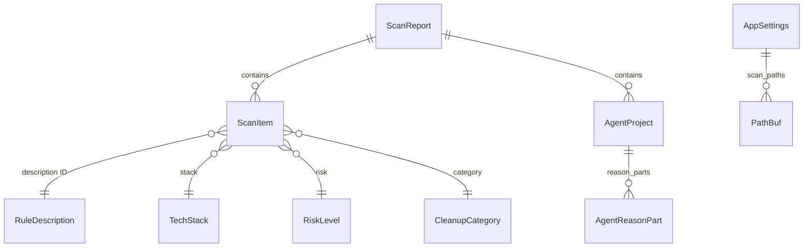

# Database Overview

CLV3000 Plus does not use a relational database, document store, or ORM. That is intentional: the app's data model is "what exists on disk right now," and persisting scan results would quickly become stale the moment another tool creates or deletes files. Instead, the system uses a small set of local file artifacts and in-memory structures.

## Persistence Strategy

| Data | Storage | Location / Type |
|------|---------|-----------------|
| User preferences | JSON file | `settings_path()` → `~/.config/clv3000/plus/settings.json` (`settings/mod.rs:48`) |
| Soft-deleted items | Filesystem directory | `trash_dir()` under app data (`paths.rs`) |
| Scan results | In-memory only | `AppStore.last_report` (`app/state.rs:60`) |
| Rule translations (source) | JSON | `scripts/rule-description-translations.json` |
| Rule descriptions (generated) | Rust enum | `crates/clv-core/src/messages/rule_description.rs` |

## Why No Database?

A cleanup utility's authoritative state is the filesystem itself. Storing scan snapshots in SQLite would add migration burden, sync complexity, and stale-data risk without improving safety — users must always confirm deletion against current reality. The scan → review → delete loop is designed to be repeatable: each scan rebuilds `ScanReport` from scratch via `Scanner::scan` (`scanner.rs:54`).

Agent project metadata is derived at scan time from paths and heuristics (`agent.rs:51`), not from a project registry table.

## Entity Relationship (Conceptual)

Although there is no SQL schema, these conceptual relationships guide the domain model in `models.rs`:

`ScanItem.project_root` optionally links items to an `AgentProject.path` for bulk selection in the Agent view.

## Trash Lifecycle

Soft-deleted paths are renamed with timestamp and UUID (`cleanup.rs:63–68`). `purge_old_trash(days)` removes entries older than `soft_delete_days` from settings — this is filesystem cleanup, not a `DELETE FROM` query.

## Summary

No migrations, no connection strings, no ORM. If you are looking for schema files or SQL, none exist in this repository. For data modeling details, see `4.Deep-Exploration/models.md` and `crates/clv-core/src/models.rs`.
