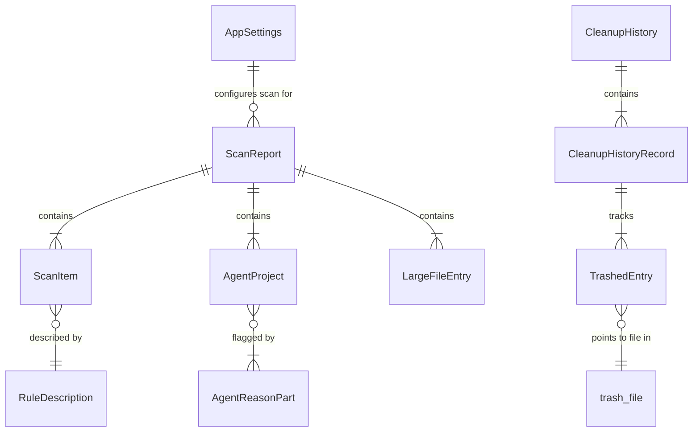

# Database Overview

CLV3000 Plus does not use a relational database, ORM, or SQL migration system. A scan of the repository found no `.sql` files, `migrations/` directories, or database dependencies (diesel, sqlx, prisma, etc.). This is intentional: the app is a single-user desktop utility whose data model is small, document-shaped, and needs no joins or queries.

Instead, the app persists state as **JSON files** on the local filesystem and soft-deleted blobs in an app-managed trash directory. Understanding this "schema-less but typed" approach is key to extending the app or debugging user data issues.

---

## Persistence Model

Think of persistence like a filing cabinet with four drawers—settings, last scan snapshot, cleanup history, and physical trash—each independently readable and editable (though manual edits are discouraged).

| Logical entity | Storage location | Rust type | Definition |
|----------------|------------------|-----------|------------|
| User preferences | `{config_dir}/settings.json` | `AppSettings` | `crates/clv-core/src/settings/mod.rs:18` |
| Last scan | `{config_dir}/last_scan.json` | `ScanReport` | `crates/clv-core/src/models.rs:123` |
| Cleanup history | `{config_dir}/cleanup_history.json` | `CleanupHistory` | `crates/clv-core/src/cleanup.rs:48` |
| Soft-deleted files | `{data_local_dir}/trash/` | Filesystem blobs | `trash_dir()` — `settings/mod.rs:90` |

Config and data paths resolve through:

```rust
directories::ProjectDirs::from("com", "clv3000", "plus")
```

On macOS this typically maps to `~/Library/Application Support/clv3000/plus/` (config) and a local data directory for trash.

---

## Entity Relationships (Conceptual)

Although not stored in SQL, the JSON entities relate logically:



---

## Retention Policies

| Data | Policy | Code reference |
|------|--------|----------------|
| Cleanup history records | Pruned after 90 days | `CleanupHistory::prune_old` — `cleanup.rs:86-89` |
| Trash files | Purged on startup if older than `soft_delete_days` | `purge_old_trash` — called from `AppStore::new` at `state.rs:109-114` |
| Last scan | Persisted until overwritten by next scan | `save_last_scan` — `settings/mod.rs` |
| Settings | Persisted until user changes | `save_settings` — `settings/mod.rs:78` |

---

## Why No Database?

| Considered | Chosen | Reason |
|------------|--------|--------|
| SQLite | JSON files | No relational queries needed; simpler backup (copy JSON); transparent debugging |
| Embedded KV store | serde_json | Schema already defined as Rust structs with derive Serialize |
| Cloud sync DB | Local only | Privacy and offline-first design—no network stack in the app |

If future features require full-text search across scan history or multi-user sync, SQLite would be the natural upgrade path—but the current scope does not justify that complexity.
