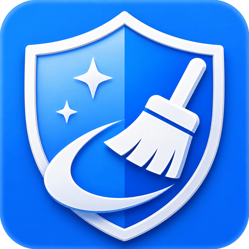
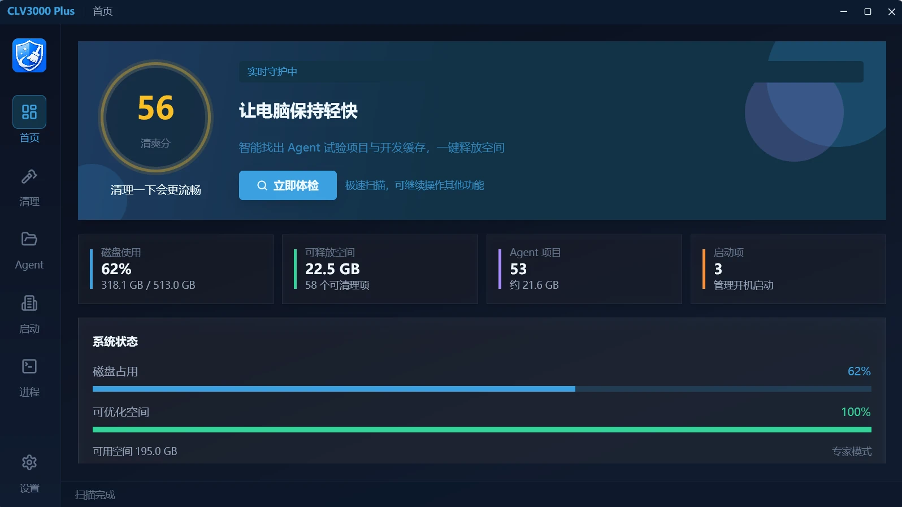
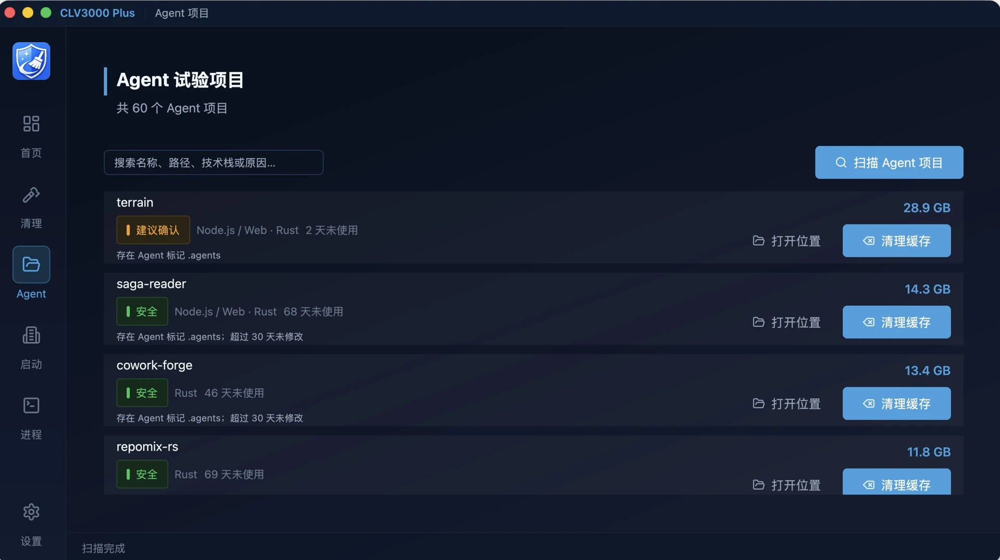
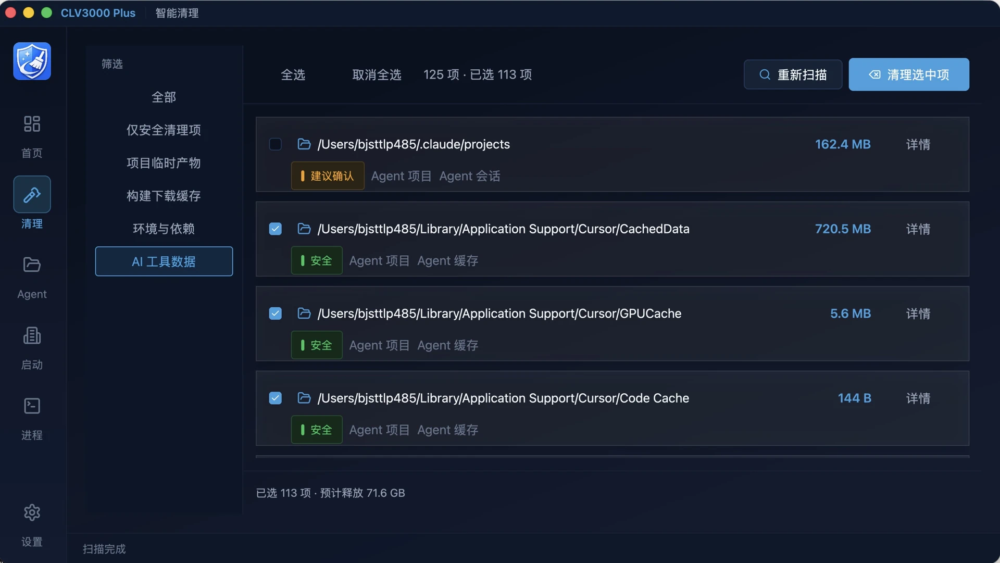

    

# CLV3000 Plus

**让 Agent 帮你干活，磁盘空间留给你自己**

你用了不少 WorkBuddy、Deepseek Harness、Codex、Claude Code、Cursor这类 AI 工具吧？  
很可能已经攒下不少「当时觉得有用、后来再也没打开过」的项目文件夹 - 每个都带着缓存、依赖和 Agent 留下的痕迹，悄悄吃掉几十 GB 空间。

CLV3000 Plus 是一款装在电脑上的清理工具，支持Windows、MacOS，专门帮**正在用各类 Agent 的准技术 / 非技术朋友**理清这些烂摊子：哪些可以删、占了多少空间、删之前让你看清楚再动手。

### 绿色轻量，快得离谱

不臃肿、不拖慢电脑。CLV3000 Plus 采用与 **Codex 同源**的高性能 **Rust** 技术构建，运行速度极快，CPU与内存占用极低。哪怕是几年前的老电脑，打开、扫描、清理也能快得飞起。

| | | |
|:---:|:---:|:---:|
|  |  |  |
| 主界面 / 仪表盘 | Agent生成物清理 | 电脑存储优化 |

---

## 它能帮你做什么

- 找出 Agent 留下的试验项目：扫描后你会看到一张清单，**项目名称、占多大空间、为什么被识别出来、多久没动过**。一目了然，再决定留还是删。
- 安全地清理缓存和依赖：除了 Agent 项目，还会帮你找出各技术栈的构建缓存和依赖目录（如 `node_modules`、`target` 等）
- 其他实用功能
  - **一键体检**：扫一遍常用目录，汇总可释放空间
  - **启动项管理**：减轻开机负担（macOS / Windows）
  - **进程查看**：找出占用内存过高的程序

---

## 简单模式 vs 专家模式

| | 简单模式（推荐） | 专家模式 |
|---|----------------|---------|
| 适合谁 | 日常用户、非技术背景 | 开发者、想精细控制的人 |
| 说明方式 | 用人话解释每一项 | 显示完整路径和技术细节 |
| 默认勾选 | 只选「安全」项 | 可选更多项目 |
| 切换方式 | 设置页随时可改 | 设置页随时可改 |
