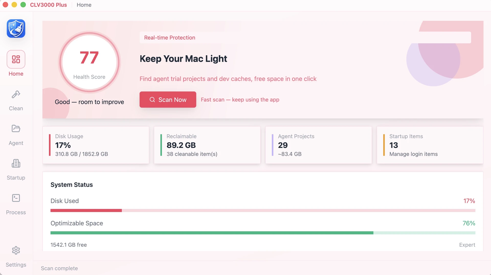
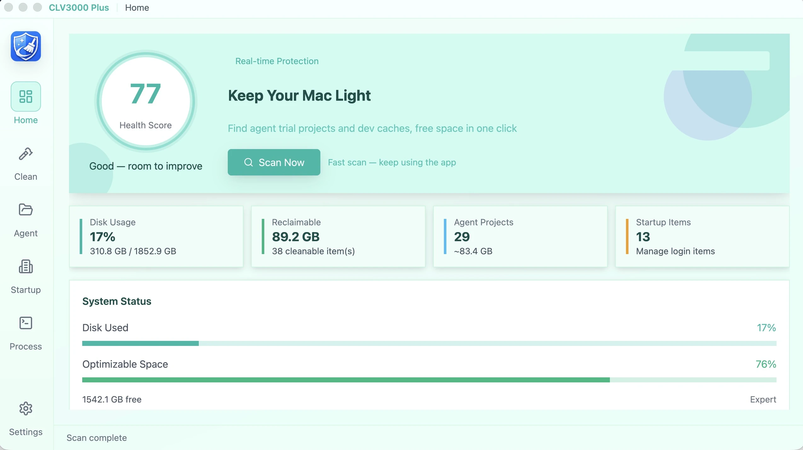
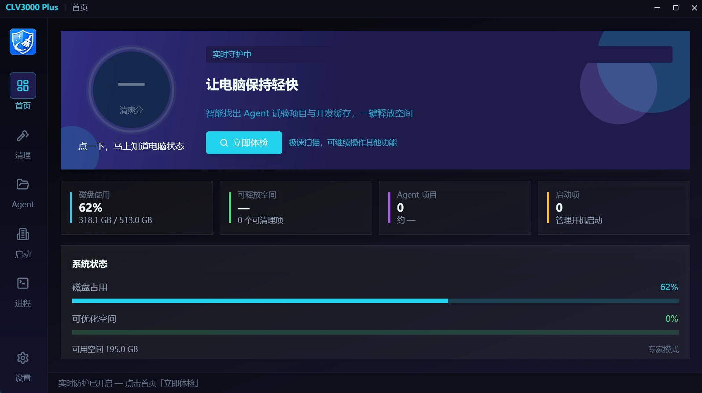

    

# CLV3000 Plus

**Let agents do the work. Keep the disk space for yourself.**

  <a href="./README_zh.md">简体中文</a> ·
  <b>English</b> ·
  <a href="./README_ja.md">日本語</a>

You have probably been using AI tools like WorkBuddy, Deepseek Harness, Codex, Claude Code or Cursor.  
Chances are you have piled up quite a few project folders that "seemed useful at the time" and were never opened again — each one carrying caches, dependencies and leftovers from your agents, quietly eating tens of gigabytes.

CLV3000 Plus is a desktop cleanup tool for **Windows and macOS**, built for people who use AI agents every day — technical or not. It sorts out the mess for you: what can be deleted, how much space it takes, and lets you see everything clearly before you commit.

### Lightweight, portable, ridiculously fast

No bloat, no slowdown. CLV3000 Plus is built with high-performance **Rust** — the same technology behind **Codex** — so it launches, scans and cleans at blazing speed with minimal CPU and memory usage. Even on a machine that is several years old, everything just flies.

| | | |
|:---:|:---:|:---:|
|  |  |  |
| Main window / Dashboard | Agent artifacts cleanup | Storage optimization |

| | | |
|:---:|:---:|:---:|
|  |  |  |
| Theme — Cherry Blossom | Theme — Aurora | Theme — Neon |

---

## What it does for you

- **Finds the experimental projects your agents left behind:** after a scan you get a list showing the **project name, how much space it takes, why it was detected, and how long it has been idle**. Everything is clear at a glance, so you decide what stays and what goes.
- **Safely cleans caches and dependencies:** beyond agent projects, it also locates build caches and dependency directories across tech stacks (such as `node_modules`, `target`, and more).
- **Other handy features**
  - **One-click checkup:** scans common directories and totals up the space you can reclaim.
  - **Startup items management:** lightens the load on boot (macOS / Windows).
  - **Process viewer:** spots the programs hogging your memory.

---

## Simple mode vs. Expert mode

| | Simple mode (recommended) | Expert mode |
|---|---------------------------|-------------|
| Who it's for | Everyday users, non-technical background | Developers, anyone who wants fine-grained control |
| How it explains | Plain language for every item | Full paths and technical details |
| What's preselected | Only "safe" items | More items available |
| Switching | Change anytime in Settings | Change anytime in Settings |
